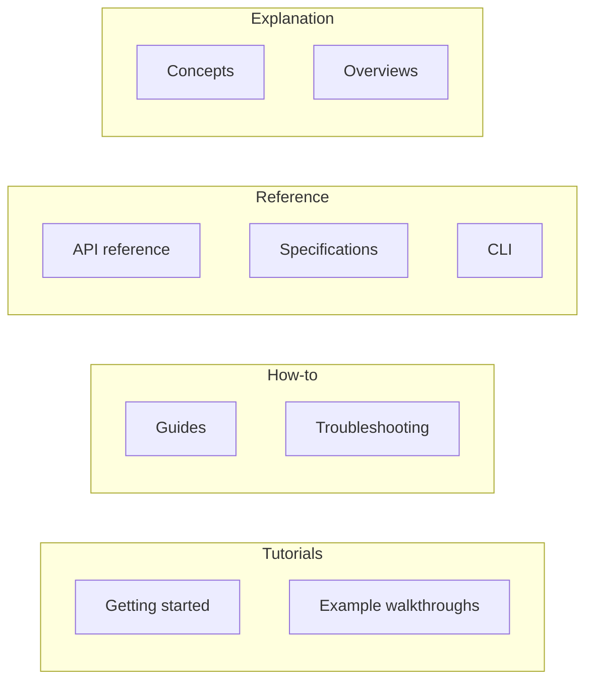
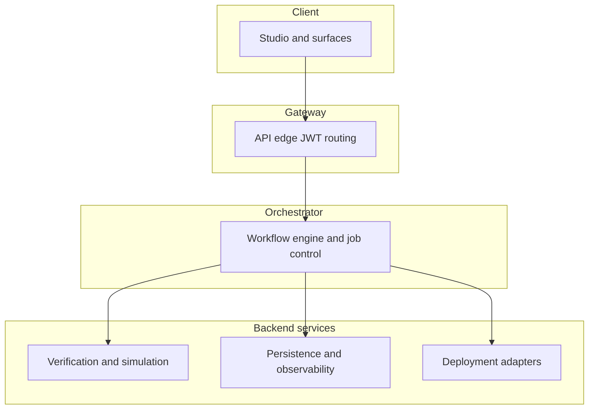
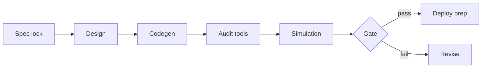

# Hyperkit Documentation: Diátaxis Knowledge Base Architecture

**Project name:** Hyperkit Documentation (public docs site)  
**Product surfaces:** HyperAgent (workflow product), ERC-1066 and x402 (protocol and payment semantics)  
**Primary audience:** Senior developers, smart contract engineers, integrators, internal stakeholders  
**Stack (site):** Next.js App Router, shared docs chrome (header, sidebar, TOC, search), content as TSX pages under `app/`

---

## 1. Purpose and Scope (HLD)

**Purpose**

- Publish a **single, navigable knowledge base** for Hyperkit’s workflow product and payment or status protocol docs.
- Separate **learning paths** (tutorials), **task execution** (how-to), **lookup** (reference), and **reasoning** (explanation) per Diátaxis.
- Support **growth**: new features attach under existing modes without renaming top-level buckets.

**Scope (in)**

- HyperAgent: Studio-oriented workflows, architecture narrative, guides, API and CLI reference, examples, troubleshooting.
- ERC-1066 and x402: concepts, gateway and agent integration guides, normative specifications, API reference, examples.
- Hub page: introduction, documentation map, reading paths.

**Scope (out)**

- HyperAgent **implementation source** (full repo walkthrough). Link to GitHub instead.
- Non-Hyperkit third-party product manuals.
- Legal or commercial terms (unless a dedicated section is added later).

**Design principles**

- **Principle of disclosure:** Sidebar shows two product trees under a small “Start here” band. Depth increases by expansion, not by many top-level names.
- **Atomic pages:** One primary intent per page (one tutorial, one how-to, one reference slice).
- **Stable URLs:** Product roots stay `/hyperagent` and `/erc1066-x402`. New content adds leaves, not new roots.

---

## 2. Knowledge Extraction (Modules and Dependencies)

| Module | Role | Depends on (conceptually) |
|--------|------|-----------------------------|
| **Introduction** (`/`) | Map, audiences, entry paths | None |
| **HyperAgent** | End-to-end smart contract workflow product | Identity, gateway, orchestration, verification backends, Studio |
| **ERC-1066 / x402** | Status semantics, policies, gateway, SDK-facing HTTP | Chain or deployment specifics only where documented |
| **Shared docs shell** | Nav, search, TOC, theme | `lib/docs-nav.ts`, layout, header, sidebar |

**High-level logic**

- Readers choose **product** (HyperAgent) vs **protocol** (ERC-1066-x402).
- Within each, they choose **mode** (tutorial vs how-to vs reference vs explanation) via page type and placement in the tree.

---

## 3. Diátaxis Mapping

| Diátaxis mode | Orientation | Hyperkit mapping (concrete) |
|---------------|-------------|-----------------------------|
| **Tutorials** | Learning, linear | `*/getting-started`, guided `examples/*` that read as a path |
| **How-to guides** | Task, problem-shaped | `*/guides/*`, troubleshooting |
| **Reference** | Information, complete | `*/api-reference/*`, `*/specifications/*`, CLI command lists |
| **Explanation** | Understanding, connections | `*/concepts/*`, product overviews, architecture deep dives |

**Visual: modes vs site areas**



**Growth rule**

- Add **tutorial** pages under `getting-started` or `examples`.
- Add **how-to** under `guides` (or topic subfolders later, e.g. `guides/deployment/`).
- Add **reference** under `api-reference` or `specifications`.
- Add **explanation** under `concepts` or dedicated `explanation/*` only if a topic outgrows concepts.

---

## 4. Wiki Sidebar Structure (Principle of Disclosure)

### 4.1 Nested outline (Markdown)

```markdown
- **Start here**
  - [Introduction](/)
- **Products and protocols**
  - **HyperAgent**
    - Overview *(Explanation + entry)*
    - Getting started *(Tutorial)*
    - Concepts *(Explanation)*
    - Guides *(How-to)*
    - API reference *(Reference)*
    - CLI *(Reference)*
    - Examples *(Tutorial / hybrid)*
    - Troubleshooting *(How-to)*
  - **ERC-1066 and x402**
    - Overview *(Explanation + entry)*
    - Getting started *(Tutorial)*
    - Concepts *(Explanation)*
    - Guides *(How-to)*
    - Specifications *(Reference)*
    - API reference *(Reference)*
    - Examples *(Tutorial / hybrid)*
```

### 4.2 Machine-readable sidebar (JSON)

Use as contract for nav generators or CMS imports. `mode` is Diátaxis; `href` matches current app routes.

```json
{
  "groups": [
    {
      "id": "start",
      "label": "Start here",
      "sections": [
        {
          "title": "Introduction",
          "href": "/",
          "mode": "explanation",
          "children": []
        }
      ]
    },
    {
      "id": "products",
      "label": "Products and protocols",
      "sections": [
        {
          "title": "HyperAgent",
          "href": "/hyperagent",
          "children": [
            { "title": "Overview", "href": "/hyperagent", "mode": "explanation" },
            { "title": "Getting started", "href": "/hyperagent/getting-started", "mode": "tutorial" },
            { "title": "Concepts", "href": "/hyperagent/concepts", "mode": "explanation" },
            { "title": "Guides", "href": "/hyperagent/guides", "mode": "how-to" },
            { "title": "API reference", "href": "/hyperagent/api-reference", "mode": "reference" },
            { "title": "CLI", "href": "/hyperagent/cli", "mode": "reference" },
            { "title": "Examples", "href": "/hyperagent/examples", "mode": "tutorial" },
            { "title": "Troubleshooting", "href": "/hyperagent/troubleshooting", "mode": "how-to" }
          ]
        },
        {
          "title": "ERC-1066 and x402",
          "href": "/erc1066-x402",
          "children": [
            { "title": "Overview", "href": "/erc1066-x402", "mode": "explanation" },
            { "title": "Getting started", "href": "/erc1066-x402/getting-started", "mode": "tutorial" },
            { "title": "Concepts", "href": "/erc1066-x402/concepts", "mode": "explanation" },
            { "title": "Guides", "href": "/erc1066-x402/guides", "mode": "how-to" },
            { "title": "Specifications", "href": "/erc1066-x402/specifications", "mode": "reference" },
            { "title": "API reference", "href": "/erc1066-x402/api-reference", "mode": "reference" },
            { "title": "Examples", "href": "/erc1066-x402/examples", "mode": "tutorial" }
          ]
        }
      ]
    }
  ]
}
```

**Implementation note:** Live sidebar source is `lib/docs-nav.ts` (`DOCS_NAV_GROUPS`). Keep it aligned with this JSON when routes change.

---

## 5. Explanation (Deep Dive): HyperAgent System

*This section is the detailed Explanation page for the most complex component: the HyperAgent workflow platform (layers, control flow, boundaries).*

### 5.1 What HyperAgent Is

HyperAgent is a **workflow system** for multi-chain smart contract delivery. It is not defined as a single conversational agent. It is an ordered pipeline: intake, policy boundaries, staged work, verification outputs, and deployment readiness.

### 5.2 Why Layers Exist

Layers isolate concerns:

- **Where** user intent and artifacts live (client).
- **Where** trust and tenancy are enforced (gateway).
- **Where** work is sequenced (orchestrator).
- **Where** tools run (backend services).

This split matches operations: you can reason about auth without re-reading codegen logic.

### 5.3 Strategic Four-Layer Model



**Client.** Captures specifications, shows runs, artifacts, settings, payments on supported flows.

**Gateway.** Authenticates and routes requests. Enforces tenant and session boundaries before work enters the orchestrator.

**Orchestrator.** Decomposes a run into stages (for example specification, design, generation, audit, simulation, deploy preparation). Owns ordering, retries, and visibility of state.

**Backend services.** Execute static analysis, simulation, storage, and deployment-related steps. Outputs feed gates and human review.

### 5.4 Runtime Agent Graph (Complementary View)

Upstream product docs describe **independent agent services** with schemas, coordinated by protocols such as A2A and registries where deployed. That view sits **inside** orchestration and backends. It answers *how* work is distributed. The four-layer view answers *where* policy and evidence attach.



### 5.5 Abstraction Boundary (What HyperAgent Does Not Remove)

HyperAgent **does not** eliminate chain-specific RPC, simulation project configuration, or deployment tooling details. It **does** unify **workflow coordination** so teams spend less time handoffs between disconnected tools.

### 5.6 Scope Honesty

Architecture narratives may be **multi-chain**. Documented closed-beta product scope may be **narrower** (for example specific networks and payment flows). Explanation pages must keep both visible so readers do not confuse roadmap with current support.

### 5.7 Related Reading (by mode)

| Mode | Where to go next |
|------|------------------|
| Tutorial | `/hyperagent/getting-started` |
| How-to | `/hyperagent/guides`, `/hyperagent/troubleshooting` |
| Reference | `/hyperagent/api-reference`, `/hyperagent/cli` |
| More explanation | `/hyperagent/concepts` |

---

## 6. Maintenance Checklist

- [ ] New feature: assign one Diátaxis mode before writing.
- [ ] Add a leaf under the correct product and mode bucket.
- [ ] Update `lib/docs-nav.ts` and this file’s JSON if public routes change.
- [ ] Prefer links to GitHub for source-of-truth code, not copying large trees into Explanation pages.

---

*Document version: 1.0. Align with Hyperkit whitepaper v1.2.0 for strategic claims; align with HyperAgent repository README for product version and stack.*
