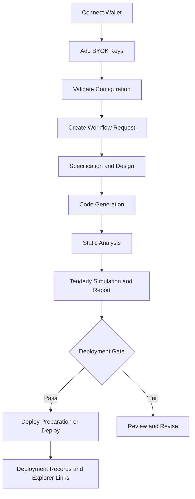
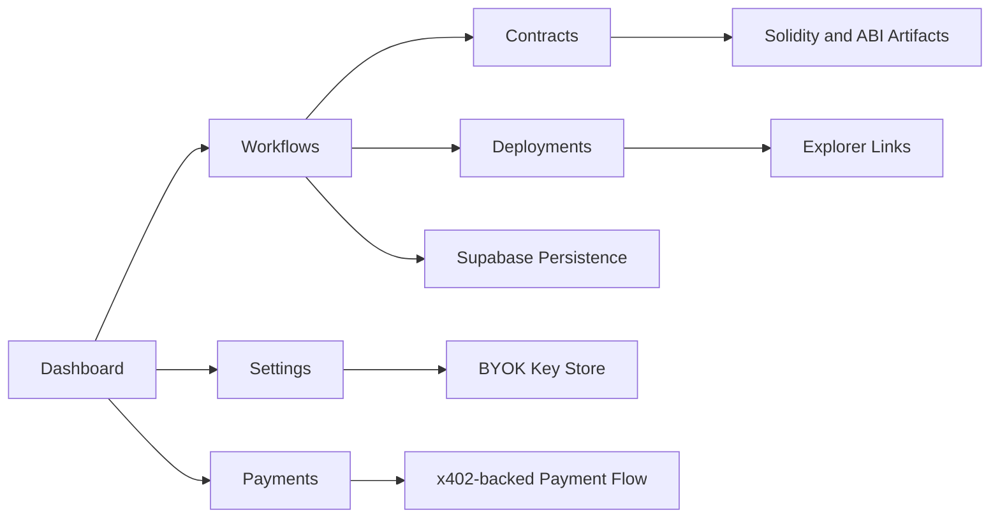

# Hyperkit Whitepaper v1.2.0

## Hyperkit: An AI-Native Workflow System for Smart Contract Delivery

### Toward a Verifiable and Deployment-Aware Web3 Application Factory

Author: Justine Lupasi  
Version: 1.2.0  
Date: April 14, 2026

## Abstract

Hyperkit is an AI-native workflow system for smart contract delivery. It addresses a recurring coordination problem in Web3 development: teams still move across specification, code generation, audit, simulation, and deployment through disconnected tools and chain-specific steps. In multi-chain settings, this burden affects release speed, verification cost, deployment quality, and the practical ability to maintain a reliable shipping process.

The technical and market context supports this problem framing. Peer-reviewed software-engineering studies report weak tool support, difficult debugging, and a high assurance burden in smart contract development [1]-[5]. The Solidity Developer Survey 2025 shows that mature frameworks are widely adopted, yet recurring debugging and verification pain persists [21]. Electric Capital reports that one in three crypto developers now work across multiple chains [6]. Mordor Intelligence estimates the smart contracts market at USD 3.12 billion in 2026 [22], while Sherlock reports audit costs ranging from approximately USD 5,000 for simple systems to USD 250,000 or more for enterprise-grade multi-chain systems [23].

Hyperkit responds through HyperAgent, a four-layer architecture composed of Product Studio, a gateway layer, a workflow engine, and backend verification and release services. The current product truth is narrower than the long-term architecture direction: a concrete MVP workflow path exists, while broader application-factory scope remains a maturity goal. This paper defines the problem hypothesis, falsification rule, architecture, market model, pricing model, and roadmap from experiments to maturity. It also separates implementation-backed answers from unresolved commercial questions so that current claims remain both ambitious and defensible.

## Keywords

smart contract engineering, multi-chain development, workflow fragmentation, AI-native tooling, blockchain interoperability, developer productivity, verification pipeline, Web3 infrastructure

## 1. Introduction

### 1.1 Problem Statement

Smart contract teams still repeat too much coordination work every time they ship across chains. The burden does not arise from code authoring alone. Teams also move across specification documents, scaffolds, audit tools, simulators, deployment scripts, explorer verification paths, and chain-specific adapters before a release is judged safe enough to ship. Research supports the broader pattern behind this claim: smart contract development still suffers from weak tooling, difficult debugging, and a high assurance burden [1], [2], [3], while fragmented work and repeated task switching continue to reduce productivity in knowledge work [4].

In non-technical terms, the problem is simple. Smart contract teams still repeat too much coordination work every time they ship across chains.

### 1.2 Significance

Multi-chain development amplifies this problem because the release path must reconcile different execution environments, trust assumptions, toolchains, verification surfaces, and deployment requirements. Interoperability research reports these structural differences directly [5]. Electric Capital further reports that one in three crypto developers now work across multiple chains [6]. The Solidity Developer Survey 2025 shows that even developers using the dominant framework stack still report meaningful debugging and compiler-adjacent friction [21]. A workflow problem at this layer therefore affects more than engineering convenience. It affects release speed, security review cost, deployment quality, and the operating burden of maintaining production systems.

### 1.3 Scope and Contributions

This paper takes the position that Hyperkit should be described in two layers.

1. Current product truth:
   Hyperkit is an AI-native workflow system for smart contract delivery.
2. Maturity direction:
   Hyperkit is evolving toward a Web3 application factory that converts validated specifications into runnable, verifiable, and deployment-aware starter applications.

This whitepaper provides five contributions.

1. A formal problem hypothesis for workflow fragmentation in multi-chain smart contract delivery.
2. A falsification rule for early user validation.
3. A four-layer system model for HyperAgent.
4. A bottoms-up market sizing method based on workflow spend.
5. A governance and roadmap model for phased execution.

The v1.2.0 revision also answers the main weaknesses identified in prior feedback: weak opening clarity, unclear market size, feature-heavy product description, and insufficient separation between milestone credibility and user validation.

The paper does not claim that Hyperkit already produces launch-complete applications, that market demand is fully validated, or that pricing and enterprise hardening are fully proven. It instead aims to define the strongest current implementation and validation position that can be supported by research, implementation evidence, and explicit remaining gaps.

### 1.4 What This Paper Does Not Claim

This paper does not claim:

1. launch-complete application output
2. fully validated market demand
3. validated pricing
4. enterprise-grade hardening across all flows
5. uniform multi-chain maturity

The claims in this paper are intentionally narrower. They concern the implemented workflow path, the current system boundary, the current evidence base, and the remaining questions that still require direct customer or production proof.

The paper is organized as follows. Section 2 summarizes the research context for smart contract workflow burden, interoperability, and security-tool overhead. Section 3 defines the problem hypothesis, the validation method, the HyperAgent system model, and the market-sizing method. Section 4 reports what is currently supported, what remains indirect, and what remains unproven. Section 5 interprets those findings in product, market, and execution terms. Section 6 closes with the current thesis status and the remaining validation work.

## 2. Background and Related Work

### 2.1 Smart Contract Development Constraints

Zou et al. studied smart contract development through 20 interviews and a survey of 232 practitioners [1]. The study identified weak security assurance, limited tooling, language and virtual machine constraints, performance tradeoffs, and limited learning resources. Sillaber et al. argued that smart contract engineering requires stricter pre-release validation because deployed logic is difficult to correct after publication [2].

These findings matter because Hyperkit is not attempting to solve a generic productivity problem. The target problem sits at the intersection of software engineering burden and deployment risk. If smart contract teams already face weak tools, high assurance cost, and difficult debugging, then a workflow product must do more than generate code. It must also reduce coordination cost across the steps that determine whether code is safe enough to ship.

The Solidity Developer Survey 2025 reinforces this picture with a broader current sample. The survey reports 1,095 usable responses from 87 countries, with 70 percent of respondents identifying as smart contract developers [21]. Solidity usage remains frequent, with 49 percent reporting daily use and 32 percent reporting weekly use [21]. This matters for the whitepaper because it shows that the target ecosystem is active and technically engaged, while still reporting recurring engineering friction.

### 2.2 Interoperability and Multi-Chain Delivery

Blockchain interoperability remains difficult. Belchior et al. surveyed interoperability approaches and identified recurring trust, security, and integration tradeoffs in cross-chain systems [5]. Electric Capital classifies developers as multi-chain when their work spans multiple chains or multi-chain infrastructure categories such as wallets, bridges, or RPC providers [6]. This classification indicates that multi-chain delivery is a large and growing development mode.

### 2.3 Security Tooling and Workflow Overhead

Security tooling remains necessary and uneven. He et al. reviewed open-source smart contract vulnerability tools and reported usability issues, uneven maintenance, and inconsistent outputs across tools [3]. Mark, González, and Harris reported that 57 percent of working spheres were interrupted in fragmented knowledge work [4]. The combined record supports a practical inference. Tool quality alone does not remove coordination overhead.

This distinction is central to the Hyperkit thesis. The problem is not the absence of individual tools. The problem is the cost of moving between tools, reconciling outputs, preserving context, and deciding whether a contract is ready for deployment. The product therefore focuses on workflow integration rather than on isolated point functionality.

The Solidity Developer Survey 2025 sharpens this point. Foundry is the dominant primary framework at 57 percent, while Hardhat v2 and v3 together account for 33 percent [21]. Remix remains a widely used secondary framework at 41 percent, and the most used SDKs and libraries are ethers.js at 70 percent, viem at 39 percent, and wagmi at 33 percent [21]. The same survey reports that recurring issues remain common despite this maturing tool stack: stack-too-deep errors at 47 percent, bytecode-size limits at 33 percent, and debugging issues at 33 percent [21]. This combination supports a narrower conclusion. Tooling has matured, but workflow burden has not disappeared.

## 3. Methodology and Approach

### 3.1 Research Design

The v1.2.0 revision uses three evidence classes. Peer-reviewed papers support engineering and workflow claims. Institutional or official market summaries support current developer and ecosystem context. Internal Hyperkit records support product design, governance, and milestone reporting. The document keeps these evidence classes separate in the main text so that research support, market context, and internal assumptions are not conflated.

### 3.1.1 High-Fit ICP Definition

The term high-fit ICP has an operational definition in this paper. A high-fit interview target meets most of the following conditions.

1. Ships smart contract code on a bi-weekly or faster cadence.
2. Works across more than one chain, or maintains chain-adjacent infrastructure used across multiple chains.
3. Uses at least one formal audit, simulation, or deployment workflow before release.
4. Has recurring coordination cost in specification, generation, audit, simulation, or deployment.
5. Controls budget directly, or strongly influences the choice of tooling, audit, or workflow software.

### 3.1.2 Interview Recruitment and Measurement

The validation method uses a structured interview program. Recruitment is separated into two channels so that rapid learning from trusted introductions does not become the sole evidence base.

1. Warm intros from founder, ecosystem, and hackathon networks.
2. Cold outreach through GitHub, open-source communities, and partner ecosystems.

Each interview records five variable groups. The purpose of this structure is to separate descriptive context from pain intensity, current spend, workaround behavior, and adoption quality.

1. Background variables:
   team size, role, chain count, shipping cadence.
2. Pain variables:
   workflow stage ranking, delay frequency, risk concentration.
3. Spend variables:
   audit spend, simulation spend, deployment-service spend, contractor or tooling spend.
4. Behavior variables:
   current toolchain, workaround behavior, repeated manual steps.
5. Adoption variables:
   willingness to test on a live workflow, return intent, buying process, pricing sensitivity.

The interview sequence is also separated analytically. This prevents the process from collapsing into unstructured founder conversations.

1. Warm intros for signal speed.
2. Cold outreach for bias correction.
3. Pain ranking for workflow priority.
4. Spend validation for budget proof.
5. Adoption intent for near-term conversion quality.

### 3.2 Problem Hypothesis and Falsification Rule

The core hypothesis is stated as follows.

Web3 developers and small smart contract teams face a recurring workflow fragmentation problem because they still coordinate specification, code generation, audit, simulation, and deployment across disconnected tools and chain-specific steps.

The falsification rule is stated as follows.

If, after ten interviews with high-fit users, fewer than six confirm that they spend five or more hours per week, or meaningful money, trying to solve this problem, the hypothesis is false for the current target segment.

This threshold functions as an internal validation benchmark. The literature does not define this threshold.

The practical meaning of this rule is simple. Hyperkit does not treat market pain as proven because the product team believes it is important. The claim stands only if high-fit teams describe recurring pain, recurring spend, or recurring delay strongly enough to support adoption behavior.

### 3.3 HyperAgent System Architecture

Figure 1 summarizes the HyperAgent system model used in this whitepaper.

Figure 1. HyperAgent four-layer pipeline. Client Layer to Gateway Layer to Orchestrator Layer to Backend Services.

The four layers are defined below.

\begin{table}[h]
\centering
\caption{HyperAgent four-layer architecture}
\begin{tabular}{|p{3.1cm}|p{4.8cm}|p{5.2cm}|}
\hline
Layer & Core components & Primary role \\
\hline
Client Layer & Studio workspace, Next.js interface, SDK and CLI surfaces & Project intake, artifact review, workflow control \\
\hline
Gateway Layer & API gateway, JWT authentication, request routing, status handling & Tenant isolation, access control, request management \\
\hline
Orchestrator Layer & LangGraph workflow engine, agent router, queue-backed job control & Task decomposition, stage routing, execution control \\
\hline
Backend Services & Slither, Mythril, Tenderly, storage, observability, deployment adapters & Static analysis, simulation, persistence, deployment, monitoring \\
\hline
\end{tabular}
\end{table}

This system model comes from internal HyperAgent design records [8]. The model is included as a product design reference.

### 3.3.1 Product Narrative

The product narrative follows three points.

1. Hyperkit built a unified multi-chain SDK and an AI-native workflow system centered on HyperAgent.
2. Hyperkit differs from template libraries and point tools by placing generation, audit, simulation, and deployment inside one orchestrated flow.
3. Current proof consists of live demonstration maturity, internal architecture maturity, and competition milestones. These items indicate execution quality. They do not replace user validation.

In this model, the product is not presented as a single monolithic assistant. It is presented as a structured workflow system. Studio captures intent and exposes project state. The gateway enforces tenant and request boundaries. The orchestrator breaks the workflow into ordered stages. Backend services perform verification, persistence, and deployment tasks. This separation makes the abstraction legible and makes the system easier to audit.

### 3.3.2 Workflow Semantics

The HyperAgent workflow starts with a project specification and ends with deployable artifacts plus verification outputs. A request enters through Studio, passes through the gateway for authentication and routing, enters the orchestrator for stage planning, and then reaches backend services for generation, static analysis, simulation, storage, and deployment preparation. Each layer has a narrow role. This sequencing clarifies where context is created, where policy is enforced, where work is decomposed, and where outputs are verified.

### 3.3.3 Abstraction Boundary

The architecture abstracts workflow coordination, not chain physics. Hyperkit abstracts project intake, routing, artifact generation, verification sequencing, and deployment preparation. It does not eliminate the need for chain-specific adapters, network-specific verification settings, or backend integrations such as Tenderly projects, RPC endpoints, or deployment frameworks. This boundary is important because the product claim is workflow unification, not total removal of network-specific implementation detail. Hyperkit is therefore positioned as a workflow layer above chain-specific execution detail, not as a universal compiler that removes network-specific engineering altogether.

### 3.3.4 Current Studio Implementation

The broader HyperAgent architecture targets multi-chain smart contract delivery. The current Studio implementation is narrower. The current Studio guide describes a workflow that connects a wallet, configures model keys through BYOK settings, validates configuration, and then runs a workflow that includes specification, design, code generation, audit, Tenderly simulation, reporting, and deployment preparation or deployment when gates permit [8]. The current implementation explicitly supports SKALE Base Mainnet and SKALE Base Sepolia for wallet-based identity, deployment, and payment flows [8].

This distinction should remain explicit throughout the paper. Hyperkit is presented as a multi-chain framework at the product-architecture level. The currently documented Studio implementation is a narrower operational surface on supported SKALE Base flows.

The documented Studio surfaces are:

1. Dashboard for workflows, deployments, metrics, and onboarding.
2. Workflows for run creation, monitoring, status, logs, and results.
3. Contracts for generated Solidity and ABI artifacts.
4. Deployments for deployment records and explorer links.
5. Settings for BYOK key management.
6. Payments for x402-backed payment handling on supported SKALE Base flows [8].

### 3.3.5 Operational Flow and Diagram Design

Figure 2 presents the documented Studio operational flow. Figure 3 presents the application-surface view used to describe Studio. These diagrams are written in Mermaid so the architecture can be rendered consistently across Markdown, presentation, and engineering documentation.

Figure 2. Studio operational flow.

Figure 3. Studio application surfaces.

### 3.3.6 MVP Path and Implementation Status

Repository evidence shows that HyperAgent already has a concrete MVP path and is not only a conceptual architecture. The current production path is Studio to API gateway to orchestrator to compile, audit, simulation, deploy, and storage services [14], [15], [16]. The same repository materials also show that Phase 1 is intentionally narrowed to one primary end-to-end lane rather than a broad multi-chain release matrix [14]. The architecture should therefore be read as a real control-plane design with a constrained MVP path, not as a claim that every chain, service, and workflow stage is equally mature today.

### 3.4 BYOK Security Model

The security model follows a Bring Your Own Key approach. User model keys are not intended for persistent server-side storage. Session credentials are isolated, encrypted during active use, and removed after run completion. This policy reduces custody risk and narrows the effect of a server-side compromise [8].

This section also answers a scope question raised by the feedback. The BYOK model is a system-design answer to a trust problem. It is not presented as final proof of production security. The current evidence base supports the design rationale, but not a claim of complete security verification.

Repository guidance narrows the implementation claim further. The current project constitution states that Phase 1 BYOK is intentionally minimal, with constrained write and read-for-run paths and short-lived request-scoped use where configured [14]. The current evidence therefore supports both the design rationale and a limited implementation surface, but not a claim of complete operational hardening.

### 3.4.1 BYOK Design Concepts and Techniques

The current repository makes the BYOK model specific enough to describe in technical terms. The design uses several concrete security concepts.

1. Request-scope decryption.
   The intended model is that keys are decrypted only for the duration of a workflow request or a tightly bounded session path, not as long-lived process state [18].
2. Encryption at rest.
   Repository policy and gap documentation state that keys should be encrypted at rest and should never be returned in plaintext responses or logs [18].
3. Browser-side key handling for session-only flows.
   The Studio session-store implementation uses the Web Crypto API with PBKDF2, SHA-256, and AES-GCM for session-only key encryption and decryption. The client derives a 256-bit AES-GCM key, uses random salts and 12-byte initialization vectors, and stores ciphertext rather than plain keys in browser session state [19].
4. Constrained write and read paths.
   The current design narrows key access to a small number of routes: write, delete, validate, and read-for-run behavior through the authenticated settings surface [20].
5. Gateway-enforced authentication.
   The gateway policy requires JWT authentication on non-public API paths. Current repo guidance also strips client-supplied user identity headers and can attach an HMAC-backed identity signal for downstream trust boundaries [18].
6. Fail-closed rate limiting on sensitive paths.
   BYOK routes are part of the stricter rate-limited path set. The gateway documentation states that production rate-limit failure should return an explicit failure rather than silently permit key operations [18].
7. Workspace-scoped key handling.
   The current settings API and Supabase-backed design indicate a per-workspace model for configured providers and key management, which supports tenant isolation when paired with RLS and service-role discipline [20], [18].
8. Audit trail and provenance alignment.
   Because HyperAgent already tracks runs and steps in the control plane, BYOK use is intended to align with the same evidence model used for workflow execution, rather than existing as an opaque side path [16].

The same repository also shows what is not yet fully closed. Rotation and re-key workflow, full plaintext-leakage auditing, complete proof of row-level isolation, and complete proof of fail-closed enforcement across all production conditions remain open items in the gap register [18]. The whitepaper therefore describes BYOK as a concrete and safety-oriented design with partial implementation proof, not as a completed security claim.

### 3.4.2 Production-Ready Definition

In this paper, production-ready does not mean feature-complete or launch-complete. It means the generated project is runnable, structurally sound, includes baseline authentication and database wiring, compiles contract artifacts, passes initial verification, contains a deployment path, and is ready for a team to review, extend, and take to final launch.

It does not imply:

1. fully polished UI
2. complete feature parity
3. enterprise hardening
4. final audited security
5. final compliance approval
6. zero remaining engineering work

### 3.4.3 Starter-Kit Output

The target output should be understood as a product starter kit rather than as a collection of isolated code snippets. A production-ready starter output should include:

1. application shell:
   frontend scaffold, backend scaffold, sane folder structure, environment configuration, and setup documentation
2. core product wiring:
   baseline authentication, database connection, schema or migration files, basic routes or services, and shared configuration wiring
3. contract layer:
   smart contract source files, compilable artifacts, deployment scripts or configuration, and initial tests or test scaffolds
4. verification layer:
   compile success, baseline checks, audit hooks, security-scan hooks, and simulation hooks where relevant
5. deployment path:
   deployment scripts, environment mapping, network targets, and handoff notes for final launch hardening
6. handoff quality:
   documented assumptions, known gaps, explicit TODOs, extension points, and readable code structure

This output should be treated as handoff-ready, not launch-finished.

### 3.5 Market Sizing Method

The market model uses workflow spend, not token market capitalization, as the main unit. This is a deliberate correction to earlier framing. TVL may indicate ecosystem scale. It does not directly indicate software budget, workflow spend, or buyer willingness to pay.

\begin{table}[h]
\centering
\caption{Bottoms-up TAM, SAM, and SOM model}
\begin{tabular}{|p{2.2cm}|p{4.0cm}|p{6.9cm}|}
\hline
Layer & Definition & Basis \\
\hline
TAM & Annual workflow spend across teams that build and maintain multi-chain smart contract systems & Anchored to two external signals. Electric Capital reports that one in three crypto developers work across multiple chains [6]. DefiLlama reported about \$98B in DeFi TVL on April 14, 2026 [7]. Hyperkit then models software spend from recurring workflow events rather than from TVL alone. \\
\hline
SAM & Teams whose release cadence and risk profile fit the Hyperkit wedge & Builders shipping on-chain code on a bi-weekly or faster cycle, with recurring audit, simulation, or deployment coordination cost. \\
\hline
SOM & First reachable segment for the current product & Small teams of 5 to 30 people, plus high-output solo builders and auditors reached through partner ecosystems, hackathons, GitHub, and open-source channels. \\
\hline
\end{tabular}
\end{table}

The unit-economics model is defined below. It is intended to convert community-size context into a workflow-software view of the market.

Annual workflow spend per team =

1. audit spend avoided or reduced
2. simulation and tooling spend
3. release coordination time value
4. deployment-preparation overhead

This formulation answers the main TAM, SAM, and SOM criticism directly. TVL provides ecosystem context. Developer counts provide community-size context. Workflow spend provides the product market unit.

Top-down market context can still be used carefully. Mordor Intelligence estimates the smart contracts market at USD 3.12 billion in 2026 and USD 7.73 billion by 2031 [22]. This estimate is useful as upper-level market context. It is not used in this paper as a direct software-spend proxy for Hyperkit, and it does not replace the narrower workflow-spend model used for SAM and SOM.

### 3.5.1 Market Size Calculation

The market model uses one external developer count and one external multi-chain ratio. Electric Capital reports 23,613 monthly active crypto developers in November 2024 and reports that 34 percent of crypto developers work across multiple chains [6]. This implies about 8,028 multi-chain developers.

The v1.2.0 model then applies conservative operating assumptions.

1. Four active builders per target team.
2. Twenty percent of multi-chain developers belong to the high-fit segment that ships smart contracts on a bi-weekly or faster cycle.
3. Annual workflow spend of \$24,000 per team, modeled from four components:
   approximately \$9,000 from audit and security-workflow cost,
   \$5,000 from simulation and supporting tooling,
   \$6,000 from release coordination time value,
   and \$4,000 from deployment-preparation overhead.

\begin{table}[h]
\centering
\caption{Conservative market sizing model used in v1.2.0}
\begin{tabular}{|p{3.0cm}|p{3.4cm}|p{5.8cm}|}
\hline
Metric & Value & Basis \\
\hline
Total crypto developers & 23,613 & Electric Capital monthly active developers, Nov. 2024 [6] \\
\hline
Multi-chain share & 34\% & Electric Capital multi-chain developer share, 2024 [6] \\
\hline
Estimated multi-chain developers & 8,028 & 23,613 x 0.34 \\
\hline
Estimated multi-chain teams & 2,007 & 8,028 divided by 4 builders per team \\
\hline
Initial high-fit teams & 402 & 20\% of 2,007 teams \\
\hline
Annual workflow spend per team & \$24,000 & Internal workflow-spend planning model built from audit, simulation, coordination, and deployment-prep components [9] \\
\hline
Initial SAM & \$9.6M & 402 x \$24,000 \\
\hline
Year-one SOM at 1\% to 5\% capture & \$96K to \$480K & 4 to 20 teams in year one \\
\hline
\end{tabular}
\end{table}

This model is not a claim about current revenue. It is an assumption-led market model built from one official developer count, one official multi-chain ratio, and internal workflow-spend assumptions. Its value lies in discipline. It forces the market argument to pass through explicit filters instead of broad ecosystem rhetoric.

### 3.5.2 Filtering Logic from Community Size to Reachable Market

The filtering logic follows four steps.

1. Start with total monthly active crypto developers.
2. Filter to multi-chain developers using the external ratio reported by Electric Capital [6].
3. Convert developers to teams using a conservative builder-per-team assumption.
4. Filter those teams to the high-fit segment using shipping cadence, contract complexity, and recurring workflow-spend criteria.

This approach answers the key market criticism directly. The community-size estimate is researched. The workflow-spend estimate is still assumption-led and remains under validation. The paper therefore separates researched market context from internal monetization assumptions rather than collapsing the two.

### 3.5.3 Buyer Profiles

\begin{table}[h]
\centering
\caption{Initial buyer profiles}
\begin{tabular}{|p{2.8cm}|p{2.1cm}|p{2.4cm}|p{2.3cm}|p{2.0cm}|p{2.2cm}|}
\hline
Buyer group & Team size & Shipping cadence & Pain severity & Likely budget & Buying motion \\
\hline
Solo or two-person auditors & 1 to 2 & Weekly to bi-weekly & High during review and pre-deploy stages & Low to medium & Founder-led or lead engineer-led \\
\hline
Established DeFi core teams & 5 to 30 & Bi-weekly or faster & High across audit, simulation, and deployment coordination & Medium to high & Technical lead plus founder or product approval \\
\hline
DAO or treasury-linked teams & 3 to 15 core operators plus external contributors & Event-driven but governance-sensitive & High where failure affects treasury, governance, or grants & Medium & Committee, multisig, or treasury-led approval \\
\hline
\end{tabular}
\end{table}

These buyer groups are intentionally narrow. They were selected because each group has a plausible reason to care about generation quality, audit quality, deployment confidence, and repeated workflow efficiency. The paper therefore frames buyer selection as a filter on pain and buying motion, not as a broad claim about all blockchain developers.

### 3.6 Founder Governance and Strategic Guardrails

The governance model uses single-point ownership. Current execution is founder-led by one active operator.

\begin{table}[h]
\centering
\caption{Founder ownership matrix}
\begin{tabular}{|p{3.0cm}|p{4.0cm}|p{5.5cm}|}
\hline
Founder & Role & Final ownership \\
\hline
Justine Lupasi & CEO and active operator & Product direction, architecture oversight, validation, go-to-market, and execution \\
\hline
\end{tabular}
\end{table}

Three scope-control guardrails define early execution.

1. Validate one painful workflow before expanding the platform surface.
2. Track qualified usage over vanity metrics.
3. Confirm repeated pain across multiple high-fit teams before widening scope.

## 4. Results and Findings

### 4.1 Evidence Status of Core Claims

\begin{table}[h]
\centering
\caption{Evidence status of core claims}
\begin{tabular}{|p{5.0cm}|p{2.2cm}|p{4.8cm}|}
\hline
Claim & Status & Evidence base \\
\hline
Smart contract development suffers from weak tooling and high assurance burden & Supported & Peer-reviewed evidence [1], [2], [3] \\
\hline
Multi-chain delivery raises integration complexity & Supported in general & Interoperability research and developer report data [5], [6] \\
\hline
Fragmented workflows reduce productivity & Supported indirectly & Fragmented work research and smart contract process research [1], [2], [4] \\
\hline
Developers rewrite 80 percent of their code for each blockchain & Not established & Internal hypothesis only [9] \\
\hline
Teams lose 5 to 10 hours per week to integration overhead & Not established & Internal interview threshold only [9] \\
\hline
ERC-1066 and x402 save 200 to 500 gas per transaction & Not established & No benchmark source in current evidence set \\
\hline
\end{tabular}
\end{table}

Table 4 separates research support from internal belief. This separation is a material change from earlier drafts. The earlier whitepaper mixed architectural ambition, market ambition, and implied proof. Version 1.2.0 treats those categories separately.

### 4.2 Market and Workflow Findings

Three findings follow from the evidence set.

1. Smart contract teams face a strict pre-release burden because errors are costly after deployment [2].
2. Multi-chain development is a real and visible operating mode, not an edge case [6].
3. A workflow product aimed at generation, audit, simulation, and deployment aligns with a measurable coordination problem, even though exact time-loss figures still need direct user validation [1]-[6].
4. A conservative assumption-led market model yields an initial serviceable market of about \$9.6M in annual workflow spend, with a year-one obtainable range of about \$96K to \$480K at 1\% to 5\% capture [6], [9].

The fourth finding must be read carefully. It is not a claim that the market is already captured, nor a claim that the pricing model is proven. It is a constrained estimate showing that a narrow wedge can be large enough to matter before the product attempts broader platform scope.

The current developer survey evidence adds two further findings. First, AI use is widespread, with 88 percent of Solidity survey respondents using AI tools at least monthly, yet 45 percent report distrust in AI output [21]. Second, verification and compiler-adjacent tooling still show large awareness and usability gaps: 48 percent do not know Sourcify, 45 percent do not know SMTChecker, 35 percent do not know the IR pipeline, and 39 percent of IR-pipeline users report slow compilation [21]. These results strengthen the case for a workflow system that combines generation with verification, traceability, and release discipline rather than relying on code generation alone.

Budget context also supports the workflow thesis. Sherlock reports that 2026 audit costs range from USD 5,000 to USD 250,000 or more depending on system complexity and risk surface [23]. This does not prove that every target team will buy Hyperkit. It does show that security and workflow spend in this market is already substantial enough to justify careful pricing and ROI validation. Immunefi’s security-loss reporting further strengthens the argument that failure in deployed contract systems carries material economic cost, even when the whitepaper does not turn those losses into a direct Hyperkit ROI claim [24].

### 4.3 Technical Findings

The architecture review identifies four technical findings. These findings concern system structure and verification design, not production benchmark superiority.

1. A layered system model supports separation of concerns.
2. Static analysis and simulation belong inside the default pipeline, not as optional add-ons.
3. A queue-backed orchestrator is appropriate for multi-stage execution and retry control.
4. BYOK key isolation aligns with the security requirements of model-assisted contract workflows.

The repository also supports four narrower implementation-backed findings.

5. The control plane already uses a run-and-step model with durable step rows and optional checkpoints for resume [16].
6. The intended v0.1.0 payment contract for supported flows is x402-first on SKALE Base Mainnet and SKALE Base Sepolia [17].
7. The production hardening program is already centered on narrowing to one shippable MVP lane and proving the exact release-blocking path in CI and operations [15].
8. The security gap register explicitly distinguishes between policy intent and enforced behavior, which makes the current production boundary more legible [18].

The survey evidence supports one further technical conclusion. Because Foundry, Hardhat, Remix, ethers.js, viem, and wagmi dominate current Solidity workflows [21], Hyperkit should prioritize compatibility with those workflows before widening support into less common frameworks or more speculative package surfaces.

### 4.3.1 Technical Proof Status

\begin{table}[h]
\centering
\caption{Status of speed, quality, and efficiency claims}
\begin{tabular}{|p{4.4cm}|p{2.3cm}|p{4.8cm}|}
\hline
Claim area & Status & Interpretation \\
\hline
Time to First App under 30 minutes & Internal target & Not yet documented as an externally measured benchmark \\
\hline
Integrated audit quality improvement & Partially supported & Tooling stack is specified, but outcome quality still needs benchmark studies or production evidence \\
\hline
Deployment efficiency across chains & Partially supported & Architecture supports the claim, but measured deployment comparisons are not yet reported \\
\hline
Security improvement from BYOK and pipeline verification & Partially supported & Design logic is documented, but production-grade audit evidence is still limited \\
\hline
\end{tabular}
\end{table}

### 4.3.2 Implementation-Backed Answers

\begin{table}[h]
\centering
\caption{Implementation-backed answers from the HyperAgent repository}
\begin{tabular}{|p{4.3cm}|p{4.2cm}|p{3.9cm}|}
\hline
Question & Current answer & Remaining gap \\
\hline
What is the exact MVP path & Studio to API gateway to orchestrator to compile, audit, simulation, deploy, and storage services [15] & Full release-proof for every supported path is still incomplete \\
\hline
Is the product fully multi-chain today & No. Phase 1 is intentionally narrowed to one primary chain and one fully supported path [14] & Broader chain expansion still requires proof of stable observability and reliability \\
\hline
What is the intended payment contract & x402 is the intended v0.1.0 payment wall for supported flows [17] & Legacy credits-era wording still exists in parts of the repo \\
\hline
Does the system persist workflow evidence & Yes. Runs, run steps, and checkpoints are documented as first-class control-plane records [16] & Full production proof of all provenance claims is still incomplete \\
\hline
Is the system already production-ready end to end & No. The hardening roadmap and security gap register both document unresolved enforcement and maturity gaps [15], [18] & Several services and protections remain partial, optional-by-environment, or roadmap-level \\
\hline
\end{tabular}
\end{table}

### 4.4 Execution Milestones

Current milestone records identify the following competition results and delivery markers.

\begin{table}[h]
\centering
\caption{Current execution milestones}
\begin{tabular}{|p{4.0cm}|p{3.0cm}|p{5.0cm}|}
\hline
Milestone & Result & Relevance \\
\hline
HyperHack 2025, Metis ecosystem & First place & Early evidence of execution quality and ecosystem fit [10] \\
\hline
Hack2Build, Avalanche ecosystem & Third place & Early evidence of payment and infrastructure execution in an Avalanche context [10] \\
\hline
HyperAgent architecture program & Internal design maturity & Shift from toolkit framing to system-level workflow design [8] \\
\hline
\end{tabular}
\end{table}

These milestones indicate execution ability. They do not validate market demand on their own. This distinction is preserved explicitly because earlier materials risked treating execution success as a substitute for demand evidence.

### 4.5 Traction Framing

The current evidence separates into three categories.

\begin{table}[h]
\centering
\caption{Current traction framing}
\begin{tabular}{|p{3.2cm}|p{4.0cm}|p{5.0cm}|}
\hline
Category & Current status & Interpretation \\
\hline
Product validation & HyperHack 2025 first place in the Metis ecosystem. Hack2Build third place in the Avalanche ecosystem. & Early evidence that the team can build and present a credible product system [10] \\
\hline
Team credibility & Founder ownership is clear across product, architecture, security, and go-to-market. Internal architecture records show growing system maturity. & Evidence of execution capacity and division of responsibilities [8], [10] \\
\hline
Early user signals & No verified beta cohort size or recurring user base is documented in the current evidence set. & User validation remains incomplete and should not be overstated \\
\hline
\end{tabular}
\end{table}

The current paper therefore distinguishes delivery credibility from user adoption. The first category is documented. The third category remains open.

This distinction closes a major feedback gap. Hackathon performance and architecture maturity indicate execution proof. They do not establish market demand, repeat usage, or willingness to pay. The current draft therefore states missing traction evidence directly instead of implying it.

### 4.6 Business Model Status

The business model in v1.2.0 follows a fairer hybrid structure: low-friction entry pricing for individuals, per-team pricing for collaboration depth, and usage-based overages tied to high-value workflow events instead of aggressive seat inflation. This structure stays aligned with current developer-tool pricing norms. GitHub Copilot Pro is listed at \$10 per month for individual developers [11]. Postman Solo is listed at \$9 per month [12]. Vercel Pro developer seats are listed at \$20 per month [13]. These anchors suggest that solo entry pricing should remain near the low end of current developer-tool budgets, while higher tiers should earn their price through collaboration, governance, traceability, and support depth.

\begin{table}[h]
\centering
\caption{Revised Hyperkit pricing model in v1.2.0}
\begin{tabular}{|p{2.0cm}|p{1.6cm}|p{4.3cm}|p{4.2cm}|}
\hline
Tier & Price & Benefits and perks & Usage-based overages \\
\hline
Free & \$0 per month & One workspace, three generation runs per month, one generation plus audit run per month, basic static-analysis summary, community support, seven-day artifact retention, asynchronous docs and template access & \$1.50 per extra generation run, \$4.00 per extra generation plus audit run, deploy preparation and production deployment locked \\
\hline
Builder & \$12 per month & One seat, one workspace, twelve generation runs per month, four generation plus audit runs per month, two simulation-backed deploy-prep runs per month, BYOK workflows, exportable reports, asynchronous email support with 72-hour target response & \$1.25 per extra generation run, \$3.50 per extra generation plus audit run, \$7.00 per extra simulation-backed deploy-prep run, \$12.00 per production deployment orchestration \\
\hline
Builder Pro & \$49 per month & Two seats, two workspaces, thirty generation runs per month, ten generation plus audit runs per month, six simulation-backed deploy-prep runs per month, two production deployment runs per month, advanced report exports, thirty-day artifact retention, monthly asynchronous workflow review & \$1.00 per extra generation run, \$3.00 per extra generation plus audit run, \$6.00 per extra simulation-backed deploy-prep run, \$10.00 per production deployment orchestration \\
\hline
Team & \$79 per month & Up to five seats, shared workspace, approval controls, deployment records, usage analytics, role separation, sixty generation runs per month, twenty generation plus audit runs per month, ten simulation-backed deploy-prep runs per month, four production deployments per month, asynchronous Slack or Discord support with 48-hour target response & \$0.90 per extra generation run, \$2.75 per extra generation plus audit run, \$5.50 per extra simulation-backed deploy-prep run, \$9.00 per production deployment orchestration \\
\hline
Growth & \$199 per month & Up to fifteen seats, multi-workspace support, policy controls, audit logs, priority support, one hundred fifty generation runs per month, fifty generation plus audit runs per month, twenty-five simulation-backed deploy-prep runs per month, ten production deployments per month, ninety-day retention, quarterly asynchronous architecture review & \$0.75 per extra generation run, \$2.25 per extra generation plus audit run, \$4.50 per extra simulation-backed deploy-prep run, \$7.50 per production deployment orchestration \\
\hline
Enterprise & Custom, starting around \$750 per month & Custom seats and workspaces, SSO, SLA, compliance review support, procurement support, governance controls, dedicated asynchronous support channel, custom retention, onboarding and migration help, optional private deployment policies & Custom pooled usage or discounted committed-volume pricing per workflow event \\
\hline
\end{tabular}
\end{table}

This revised model is fair in three ways.

1. Entry cost for solo builders remains near current developer-tool budgets.
2. Each higher tier gains more included usage and lower marginal overage rates.
3. Governance, traceability, retention, and asynchronous support scale with team complexity rather than with inflated seat count alone.

The asynchronous support ladder is explicit.

1. Free: community-only support.
2. Builder: 72-hour asynchronous support target.
3. Team: 48-hour asynchronous support target.
4. Growth: priority asynchronous support plus quarterly asynchronous architecture review.
5. Enterprise: contract-backed asynchronous SLA and dedicated support channel.

The packaging logic also follows the workflow hierarchy in the product design.

1. BYOK is included in paid plans because it is part of the trust and security model, not a premium add-on.
2. Simulation-backed deploy preparation remains priced below production deployment orchestration because the product treats these as distinct workflow stages with different operational value.
3. Production deployment orchestration remains the highest-priced overage event because it carries the highest workflow value, the strongest traceability requirement, and the greatest operational consequence.

This model remains a pricing hypothesis, not a final conclusion. The proof still required is explicit.

1. Pricing interviews with budget owners.
2. ROI logic based on time saved, coordination cost reduced, or audit-cost reduction.
3. Conversion evidence showing whether freemium, per-run pricing, or per-team pricing yields stronger expansion in the high-fit segment.
4. Retention evidence showing that conversion follows repeat workflow value rather than one-time experimentation.

The current paper therefore treats the business model as research-informed, affordable, and fairness-aware, but still subject to validation.

## 5. Discussion

### 5.1 Interpretation

The evidence supports a disciplined product position. Smart contract development still suffers from weak tooling, difficult debugging, strict validation requirements, and interoperability complexity. A product that reduces coordination cost across high-risk workflow stages addresses a practical problem. The strongest current support remains qualitative and process-oriented. Direct spend and time-loss measurements still require user research.

The stronger reading of the evidence is not that Hyperkit has already won the market case. The stronger reading is that the product now has a defensible problem statement, a tractable first buyer wedge, and a clearer research program than earlier drafts. In that sense, v1.2.0 functions as a more rigorous operating document as well as a stronger whitepaper.

### 5.2 Practical Implications

Three practical implications follow from the current evidence base.

1. Contract generation plus integrated audit is the clearest initial workflow scope.
2. Time to First App is an appropriate operational metric for early evaluation.
3. Year-one capture at 1\% to 5\% of the initial serviceable segment implies winning about 4 to 20 teams, which keeps the first commercial target narrow and testable.

These implications are intentionally conservative. They push the product toward a sharper first buyer wedge, a narrower measurement framework, and a more credible validation path.

### 5.3 Limitations

This document has four limits.

1. The strongest paper base focuses on smart contract engineering in general, not only on small multi-chain startup teams.
2. The market model uses external context and internal unit assumptions, not audited revenue data.
3. Some architecture and protocol references come from internal design records, not external benchmarks.
4. Gas-savings claims and workflow time-savings claims still require controlled measurement.

An additional limitation follows from the current product stage. Chain-support breadth introduces integration debt. As chain count grows, the burden of adapters, verification settings, simulation environments, and deployment reliability also grows. This creates a direct execution risk if the product expands faster than validation or tooling depth.

### 5.4 Open Questions and Current Answers

\begin{table}[h]
\centering
\caption{Open questions and current answers at v1.2.0}
\begin{tabular}{|p{4.1cm}|p{4.2cm}|p{4.0cm}|}
\hline
Question & Current answer & Remaining gap \\
\hline
What is the current supported workflow path & A concrete MVP path exists and is documented in the repository [15] & How reliably that path performs under repeat external use \\
\hline
What is the current supported launch matrix & The documented Studio and payment path is currently centered on supported SKALE Base flows [17] & Whether that matrix should remain the only release-blocking path until broader support is proven \\
\hline
Which workflow stage likely hurts most & The current product and interview design prioritize generation, audit, simulation, and deployment coordination as the leading candidate [8], [9] & Which stage creates the strongest repeat pain by measured interview evidence \\
\hline
Which tools already receive recurring spend & Audits, simulation tooling, deployment services, and workflow glue remain the leading spend categories in the interview model [9] & Which category dominates in the high-fit segment by direct evidence \\
\hline
What is the current payment model & x402 is the intended contract for supported flows [17] & Full removal of legacy credits-era wording and behavior \\
\hline
What is the current service-maturity answer & Some service families are substantial, others remain partial or internal-only [15] & Which services are ready as independent production units versus folded internal units \\
\hline
What is the current security-posture answer & BYOK, simulation intent, gateway auth direction, and run-step provenance are real system directions [14], [16], [18] & Which protections are fully fail-closed today under production conditions \\
\hline
What is the current user-traction answer & Competition wins and architecture maturity are real & Verified beta cohort, paid pilots, retention, and repeat workflow completion still need direct reporting \\
\hline
How much integration debt can the platform absorb & The repo explicitly recognizes chain-breadth risk and MVP narrowing [14], [15] & The practical threshold for safe chain expansion is still unmeasured \\
\hline
How durable is the moat & The current moat thesis is workflow integration, control-plane traceability, and trust design & Comparative durability against incumbent tools with adjacent AI features remains open \\
\hline
\end{tabular}
\end{table}

### 5.4.1 Questions Now Better Answered

Several questions that appeared weak or ambiguous in earlier drafts now admit materially stronger answers. The improvement does not come from rhetorical refinement alone. It comes from a narrower product thesis, a more disciplined market model, and implementation evidence taken from the current HyperAgent repository. The resulting answers remain bounded, but they are now specific enough to support a more rigorous reading of the project.

\begin{table}[h]
\centering
\caption{Questions now more precisely answered in v1.2.0}
\begin{tabular}{|p{4.0cm}|p{7.8cm}|}
\hline
Question & Current answer \\
\hline
What is Hyperkit really & A workflow system for smart contract delivery, not a generic AI assistant and not only a toolkit. \\
\hline
What is HyperAgent really & The orchestration and verification layer that coordinates specification, generation, audit, simulation, and deploy preparation. \\
\hline
What exactly is abstracted & Workflow coordination, state tracking, verification sequencing, and deployment preparation are abstracted. Chain-specific execution details, chain adapters, RPC realities, and deployment backends are not fully abstracted away. \\
\hline
What counts as qualified usage & Repeat workflow completion with retained artifact history and stage completion, not signups or page visits. \\
\hline
What counts as a deployed dApp & A production or testnet application whose workflow completed through Hyperkit and whose deployment and artifacts are retained in the system. \\
\hline
What counts as an active developer & A unique builder or operator completing repeat workflow runs inside a defined time window. \\
\hline
What is the current moat & Workflow integration, control-plane traceability, BYOK trust design, verification sequencing, and artifact history. \\
\hline
Why is pricing fair & Entry pricing is anchored to current developer-tool norms, while higher tiers gain more included usage and lower marginal rates. Governance, support, and retention scale by complexity rather than by seat inflation. \\
\hline
Why is the founder roadmap stronger than the old phase list & It retires problem risk, then product risk, then market risk, then scale risk, instead of presenting broad feature accumulation as progress. \\
\hline
\end{tabular}
\end{table}

Taken together, these answers narrow the scope of the project in a useful way. They define Hyperkit as a workflow system rather than a diffuse toolkit, define HyperAgent as the orchestration and verification layer within that system, and tie pricing, qualification, and roadmap structure to measurable operational logic instead of broad narrative claims.

### 5.4.2 Questions Still Requiring New Evidence

Some questions still require direct customer or production evidence and should remain open in the current draft. The existing repository, architecture, and hardening materials improve implementation clarity, but they do not substitute for measured market behavior, paid adoption, or external performance evidence. The remaining questions therefore mark the boundary between a stronger implementation paper and a fully validated business case.

\begin{table}[h]
\centering
\caption{Questions that still require customer or production evidence}
\begin{tabular}{|p{4.0cm}|p{7.8cm}|}
\hline
Question & Missing evidence \\
\hline
Verified beta cohort size & Direct reporting on invited, active, and retained teams \\
\hline
Number of retained teams & Cohort tracking over time \\
\hline
Number of paid pilots & Contracted or invoiced customer evidence \\
\hline
Actual revenue & Revenue reporting rather than pricing assumptions \\
\hline
Actual conversion from free to paid & Funnel and billing data \\
\hline
Actual retention after first workflow use & Repeat workflow and paid-retention metrics \\
\hline
Actual willingness to pay across buyer groups & Pricing interviews and live conversion data \\
\hline
Actual Time to First App under external use & Timed benchmark data from real users \\
\hline
Actual audit-quality improvement & Comparative benchmark or production review evidence \\
\hline
Actual deployment-efficiency improvement & Comparative deployment and failure-rate data \\
\hline
Which buyer group converts first in practice & Buyer-level acquisition and conversion evidence \\
\hline
Which workflow stage hurts most by interview evidence & Structured interview results and ranked pain data \\
\hline
Which spend category dominates by real buyer data & Spend validation across the high-fit segment \\
\hline
Whether the current pricing model outperforms alternatives & Pricing experiment or conversion comparison results \\
\hline
Whether the current SKALE Base path should remain the only release-blocking path after validation & Reliability proof plus broader launch-readiness evidence \\
\hline
\end{tabular}
\end{table}

These unresolved items now have a cleaner role in the document. They are no longer mixed with answerable architecture or implementation questions. They identify the next layer of validation work required before the whitepaper can claim stronger market, pricing, traction, or performance proof.

### 5.5 Roadmap Measurement Framework

The roadmap requires measurable definitions. The following thresholds convert broad goals into qualification rules.

\begin{table}[h]
\centering
\caption{Roadmap measurement framework}
\begin{tabular}{|p{3.0cm}|p{3.2cm}|p{5.3cm}|}
\hline
Roadmap item & Target label & Operational definition \\
\hline
Phase 1 closed beta & Core SDK and HyperAgent closed beta & Repeated use by invited teams on real workflow runs, with audit and simulation stages completed in the system \\
\hline
500 active developers & Active developers & Unique builders or operators who complete repeat workflow runs within a defined time window, not signups alone \\
\hline
50 plus deployed dApps & Deployed dApps & Production or testnet applications whose contract generation and deployment flow completed through the Hyperkit workflow with retained artifact history \\
\hline
Enterprise services & Enterprise progress & Paid pilots, dedicated support requirements, compliance review needs, or team-based workflow controls \\
\hline
\end{tabular}
\end{table}

This framework answers the criticism that activity targets alone do not define qualified progress.

### 5.6 Founder Presentation Day Roadmap

For founder presentation purposes, the roadmap is compressed into four stages that retire risk in sequence: problem risk, product risk, market risk, and scale risk. Each stage spans a set of two-week sprints and closes with a hard gate.

\begin{table}[h]
\centering
\caption{Founder roadmap from experiments to maturity}
\begin{tabular}{|p{2.0cm}|p{1.8cm}|p{3.2cm}|p{3.8cm}|p{3.0cm}|}
\hline
Stage & Sprints & Strategic objective & What ships & Exit gate \\
\hline
Experiments & S0-S2 & Validate one painful workflow before expanding scope & ICP scorecard, JTBD script, pain-ranking template, spend-validation sheet, pricing interview script, narrow generation to audit to simulation to deploy-prep demo flow & Ten high-fit interviews completed, at least six confirm recurring pain or spend, five pricing interviews completed, TAM to SAM to SOM waterfall documented \\
\hline
Foundation Proof & S3-S5 & Turn the MVP from demo-ready to repeatable product system & SDK, wallet connection, BYOK, orchestration, static analysis, Tenderly simulation, run persistence, deployment records, report exports, support workflow, beta qualification rules & Invited teams complete repeat workflow runs, audit and simulation occur inside the system, release checklist and beta qualification are active \\
\hline
Market Validation & S6-S8 & Prove adoption behavior, monetization logic, and go-to-market fit & Self-serve onboarding, new-project wizard, blueprint library, freemium flow, team workspaces, usage tracking, conversion triggers, funnel analytics, pricing instrumentation & Qualified active usage is defined and tracked, deployed dApps are counted with retained artifact history, conversion behavior is observable \\
\hline
Maturity & S9-S12 & Build the operating discipline for enterprise trust and ecosystem scale & Enterprise dashboards, audit history, team controls, SLA metrics, registry, marketplace model, x402 payment automation, reconciliation, partner operations & Enterprise controls, reliability reporting, billing operations, and partner processes are live \\
\hline
\end{tabular}
\end{table}

### 5.7 Twelve-Sprint Delivery Plan

Each sprint below spans two weeks and carries both a product milestone and a proof milestone.

\begin{table}[h]
\centering
\caption{Founder-facing twelve-sprint plan}
\begin{tabular}{|p{1.1cm}|p{2.5cm}|p{4.2cm}|p{4.4cm}|}
\hline
Sprint & Focus & Concrete deliverables & KPI or proof target \\
\hline
S0 & ICP experiments & Three buyer groups, screening rubric, JTBD interview script, warm-versus-cold outreach tracker, transcript-summary format & Fifteen to twenty prospects sourced, ten interviews booked, high-fit criteria usable in screening \\
\hline
S1 & Problem proof & Structured interviews scoring pain, spend, workaround behavior, and adoption intent & At least six of ten high-fit users confirm five or more hours weekly or meaningful spend on the workflow problem \\
\hline
S2 & Pricing and market proof & Five pricing interviews, bottoms-up TAM to SAM to SOM waterfall, per-run versus per-team willingness-to-pay test & Market model tied to workflow spend, pricing model no longer narrative-only \\
\hline
S3 & Closed beta foundation & SDK, wallet connection, BYOK, orchestration, static analysis, Tenderly simulation & First invited teams run end-to-end workflows inside the product \\
\hline
S4 & Beta reliability & Run persistence, deployment records, exports, failure logging, incident process & Repeat workflow runs become trackable and diagnosable \\
\hline
S5 & Beta completion & Beta qualification, release checklist, retained-team review, milestone review & Closed beta means repeated real runs, not access granted \\
\hline
S6 & Self-serve onboarding & Wizard, blueprints, first freemium flow, standardized demo path & Lower friction from first touch to first workflow completion \\
\hline
S7 & Growth instrumentation & Team workspaces, usage tracking, conversion triggers, funnel analytics, pricing test plan & Clear view of who is evaluating, activating, and converting \\
\hline
S8 & Enterprise readiness & Monitoring dashboards, audit history, team controls, compliance checklist, procurement FAQ, risk register & Product becomes credible for paid pilots and larger team workflows \\
\hline
S9 & Operating maturity & Reliability metrics, SLA workflow, support process, KPI ownership, change-management process & Core business operations move from ad hoc to repeatable \\
\hline
S10 & Registry and marketplace & Registry, pricing metadata, job specification model, partner operations model & Agent economy readiness and partner process clarity \\
\hline
S11 & Payment automation & x402 rails, billing controls, revenue reconciliation, partner reporting & Live payment operations and auditable billing workflow \\
\hline
S12 & Maturity close & Marketplace jobs, enterprise operations, reliability reporting, partner process review & System supports enterprise trust, billing, and ecosystem scale \\
\hline
\end{tabular}
\end{table}

### 5.8 Stage Gates

The founder roadmap uses hard gates rather than broad milestone language.

1. Experiments gate:
   ten high-fit interviews completed, at least six confirm recurring pain or spend, five pricing interviews completed, and a sourced TAM to SAM to SOM waterfall is documented.
2. Foundation Proof gate:
   invited teams complete repeat workflow runs, audit and simulation occur inside the system, and beta qualification criteria are active.
3. Market Validation gate:
   qualified active usage is defined and tracked, deployed dApps are counted only with retained artifact history, and conversion behavior is observable.
4. Maturity gate:
   enterprise controls, reliability reporting, billing and payment operations, and partner processes are live.

This roadmap is risk-ordered rather than feature-ordered. It moves from experiments to foundation proof, to market validation, and then to maturity.

## 6. Conclusion and Future Work

Hyperkit v1.2.0 defines a more disciplined thesis than earlier drafts. The central problem is workflow fragmentation in multi-chain smart contract delivery. Peer-reviewed studies support the engineering burden, current developer surveys show that tooling maturity has not removed recurring workflow pain, and implementation evidence shows that HyperAgent already has a concrete MVP path through Studio, gateway, orchestrator, verification, and deployment-aware services. These elements make the current product position stronger than a broad conceptual pitch.

The current product truth should remain narrow. Hyperkit is best described today as an AI-native workflow system for smart contract delivery. Its maturity direction is broader: a Web3 application factory that converts validated specifications into runnable, verifiable, and deployment-aware starter applications. That broader framing is credible as direction, but not yet as present-tense operating scope.

The strongest current contribution of this paper is therefore clarity. It defines the problem precisely, identifies the current workflow and implementation boundary, models the market with more discipline, and separates implementation-backed answers from unresolved commercial questions. The strongest remaining work is empirical rather than rhetorical. Future progress now depends on pricing validation, customer validation, repeat workflow completion, and measured evidence for time-to-value, audit quality, deployment efficiency, and product retention.

\begin{table}[h]
\centering
\caption{Thesis status at v1.2.0}
\begin{tabular}{|p{4.2cm}|p{2.5cm}|p{4.8cm}|}
\hline
Thesis component & Status & Evidence position \\
\hline
Workflow fragmentation exists in smart contract delivery & Supported in general & Supported by engineering and workflow literature [1]-[5] \\
\hline
Multi-chain development is large enough to justify a focused product wedge & Supported in general & Supported by developer-count and multi-chain-share context [6] \\
\hline
High-fit teams will pay for an integrated generation-plus-audit workflow & Partially supported & Plausible from workflow-spend logic, still requires pricing interviews and user evidence [9] \\
\hline
Current traction proves demand & Not supported & Competition milestones prove execution, not demand [10] \\
\hline
Time-saved and efficiency claims are already measured & Not supported & Still require benchmark and production evidence \\
\hline
\end{tabular}
\end{table}

## References

[1] W. Zou, D. Lo, P. S. Kochhar, X. Xia, Y. Feng, Z. Chen, and B. Xu, "Smart Contract Development: Challenges and Opportunities," IEEE Transactions on Software Engineering, vol. 47, no. 10, pp. 2084-2106, 2021. doi: 10.1109/TSE.2019.2942301.

[2] C. Sillaber, B. Waltl, H. Treiblmaier, U. Gallersdörfer, and M. Felderer, "Laying the foundation for smart contract development: an integrated engineering process model," Information Systems and e-Business Management, vol. 19, pp. 863-882, 2021. doi: 10.1007/s10257-020-00465-5.

[3] Y. He, J. Fan, and H. Wu, "A Systematic Review and Performance Evaluation of Open-Source Tools for Smart Contract Vulnerability Detection," Computers, Materials and Continua, vol. 80, no. 1, pp. 995-1032, 2024. doi: 10.32604/cmc.2024.052887.

[4] G. Mark, V. M. González, and J. Harris, "No task left behind? Examining the nature of fragmented work," in Proceedings of the SIGCHI Conference on Human Factors in Computing Systems, Portland, OR, 2005, pp. 321-330.

[5] R. Belchior, A. Vasconcelos, S. Guerreiro, and M. Correia, "A Survey on Blockchain Interoperability: Past, Present, and Future Trends," ACM Computing Surveys, vol. 54, no. 8, 2021. doi: 10.1145/3471140.

[6] Electric Capital, "2024 Developer Report" and methodology pages, https://www.developerreport.com/ and https://www.developerreport.com/about, accessed Apr. 14, 2026.

[7] DefiLlama, "Metrics," https://defillama.com/metrics, accessed Apr. 14, 2026.

[8] Hyperkit Labs, "HyperAgent Spec," internal architecture document, 2026.

[9] Hyperkit Labs, "Problem Hypothesis and Approach Notes," internal strategy documents, 2026.

[10] Hyperkit Labs, internal milestone records and submission documents for HyperHack 2025 and Hack2Build, 2025.

[14] HyperAgent Project Constitution, AGENTS.md, Hyperkit Agent repository, 2026.

[15] HyperAgent, "Production Hardening Roadmap," internal repository document, 2026.

[16] HyperAgent, "Control plane: runs and steps," internal repository document, 2026.

[17] HyperAgent, "Payment and onboarding flow," internal repository document, 2026.

[18] HyperAgent, "Security policy vs implementation gap register," internal repository document, 2026.

[19] HyperAgent Studio, "session-store.ts," internal repository implementation file, 2026.

[20] HyperAgent Studio, "settings.ts," internal repository implementation file, 2026.

[21] Solidity Team, "Solidity Developer Survey 2025," Solidity Programming Language, 2026. Available: https://www.soliditylang.org/survey-2025/. Accessed: Apr. 19, 2026.

[22] Mordor Intelligence, "Smart Contracts Market Size and Share Analysis, Growth Trends and Forecast (2026-2031)," 2026. Available: https://www.mordorintelligence.com/industry-reports/smart-contracts-market. Accessed: Apr. 19, 2026.

[23] Sherlock, "Smart Contract Audit Pricing: A Market Reference for 2026," 2026. Available: https://sherlock.xyz/post/smart-contract-audit-pricing-a-market-reference-for-2026. Accessed: Apr. 19, 2026.

[24] Immunefi, "Research and Crypto Losses Reports," 2025-2026. Available: https://immunefi.com/immunefi-crypto-losses-report-2021/. Accessed: Apr. 19, 2026.

## Appendix A. DOCX Conversion Settings

The following layout settings apply during DOCX conversion.

1. Two-column layout.
2. Column spacing of 4.22 mm.
3. Times New Roman, 10 pt body text.
4. Main heading at 14 pt bold.
5. Subheading at 12 pt bold.
6. Sub-subheading at 11 pt bold.
7. Top and bottom margins of 19 mm.
8. Left and right margins of 17.5 mm.

## Appendix B. Interview Variables for Initial Validation Study

The initial interview set records the following variables.

1. Current workflow from specification to deployment.
2. Tools used for generation, audit, simulation, and deployment.
3. Weekly time lost to coordination across tools.
4. Current spend on audits, automation, and workflow glue.
5. Willingness to test an integrated generation-plus-audit workflow on a live project.

## Appendix C. Feedback-to-Revision Alignment

\begin{table}[h]
\centering
\caption{Feedback-to-revision alignment in v1.2.0}
\begin{tabular}{|p{3.4cm}|p{3.9cm}|p{3.8cm}|p{2.4cm}|}
\hline
Feedback weakness & Question raised & v1.2.0 correction & Section \\
\hline
Weak opening hook & How is the problem stated in one breath & Opening now leads with repeated coordination cost in multi-chain delivery & 1.1 \\
\hline
Too much jargon & How does a non-technical founder understand the pain & Added non-technical restatement of the problem & 1.1 \\
\hline
Product narrative too fragmented & What was built, why is it different, what proof exists & Added explicit three-part product narrative & 3.3.1 \\
\hline
TAM, SAM, SOM unclear & What exactly is the market size & Added explicit market formula, assumptions, and dollar model & 3.5.1 \\
\hline
Market built from assumption & Has the market size been researched & Separated official developer data from internal spend assumptions & 3.5.1, 4.2 \\
\hline
ICP definition unclear & Who is the high-fit buyer in operational terms & Added explicit high-fit ICP criteria and buyer-profile table & 3.1.1, 3.5.3 \\
\hline
Methodology unclear & How is the pain validated & Added interview recruitment method, measurement variables, and analysis sequence & 3.1.2 \\
\hline
Traction framing unclear & What is product validation versus user validation & Added separate traction framing table & 4.5 \\
\hline
Current user base unclear & What is the beta cohort size & Stated that no verified cohort size exists in the current evidence set & 4.5 \\
\hline
Pricing validation unclear & What pricing model is proven & Added business model status and missing proof requirements & 4.6 \\
\hline
Roadmap targets vague & What counts as qualified progress & Added roadmap measurement framework with operational definitions & 5.5 \\
\hline
Feature-heavy framing & Where is the proof-led structure & Reordered the document around problem, evidence, product, market, traction, and limits & 1 to 5 \\
\hline
\end{tabular}
\end{table}

## Appendix D. Reflection Questions for the Next Revision

1. Which parts of the workflow thesis are now evidence-backed, and which still rely on internal assumptions.
2. Which buyer group shows the clearest combination of pain severity, budget control, and repeat usage potential.
3. Which market assumptions should be replaced first with direct pricing or spend data.
4. Which architecture claims still need benchmark evidence before they should appear as performance claims.
5. Which roadmap targets still need tighter operational definitions.
6. Which workflow event buyers are most willing to pay for first.
7. Which product claims still exceed enforcement proof.
8. Which roadmap gate is most likely to fail first.
9. Which support tier best matches actual buyer expectations.
10. Which service boundaries should remain independent, and which should stay internal to the control plane.
